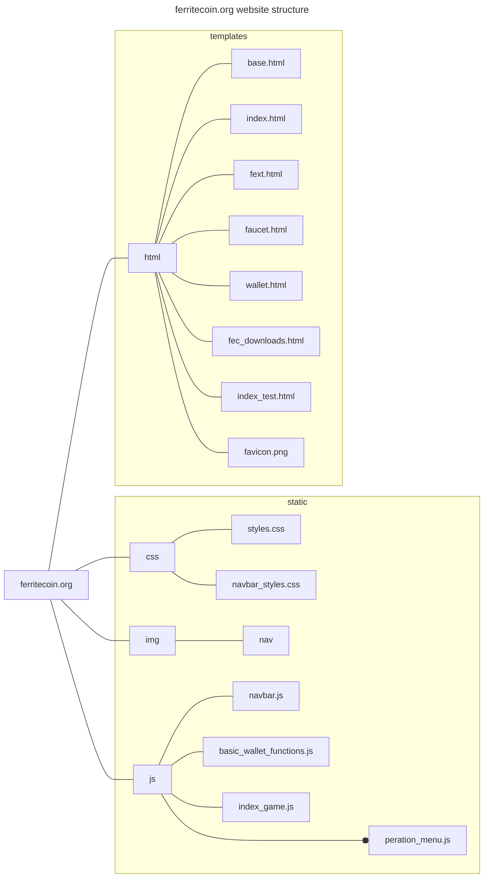

# ferritecoin-org-website

## Contributing
Fork the repository  
Push changes to local repository
Open a pull request  

## Website structure

```mermaid
---
title: ferritecoin.org website structure
---
flowchart LR
    ferritecoin.org---html
    ferritecoin.org---css
    ferritecoin.org---js
    ferritecoin.org---img
    subgraph static
        css---styles.css
        css---navbar_styles.css
        img---nav
        js---navbar.js
        js---operation_menu.js
        js---basic_wallet_functions.js
        js---index_game.js
    end
    subgraph templates
        html---base.html
        html---index.html
        html---fext.html
        html---faucet.html
        html---wallet.html
        html---fec_downloads.html
        html---index_test.html
        html---favicon.png
    end
```

